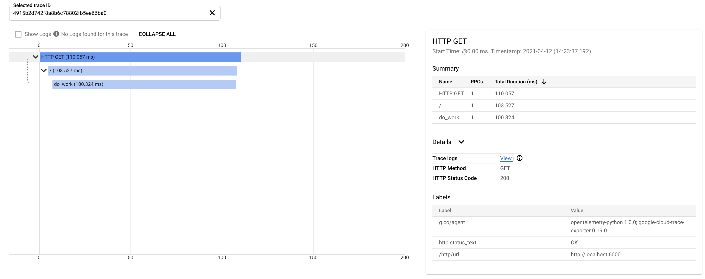

=============================
End-to-End Example with Flask
=============================

This end-to-end example shows how to instrument a Flask app with OpenTelemetry to send traces
to Cloud Trace and metrics to Cloud Monitoring. OpenTelemetry instrumentation for Flask and
requests will automatically generate spans and metrics for you. In addition, there is a client
script that uses ``requests`` to call the Flask app and propagate context with the GCP context
propagator.

To run this example you first need to:
    * Create a Google Cloud project. You can `create one here <https://console.cloud.google.com/projectcreate>`_.
    * Enable Cloud Trace API (listed in the Cloud Console as Stackdriver Trace API) in the project `here <https://console.cloud.google.com/apis/library?q=cloud%20trace&filter=visibility:public>`_. If the page says "API Enabled" then you're done! No need to do anything.
    * Enable Default Application Credentials by creating setting `GOOGLE_APPLICATION_CREDENTIALS <https://cloud.google.com/docs/authentication/getting-started>`_ or by `installing gcloud sdk <https://cloud.google.com/sdk/install>`_ and calling ``gcloud auth application-default login``.

It is also recommended to create a fresh virtualenv for running this example:

.. code-block:: sh

    python3 -m venv venv
    source venv/bin/activate

Flask Server
============

Install Dependencies
--------------------

.. code-block:: sh

    pip install opentelemetry-exporter-gcp-trace \
        opentelemetry-exporter-gcp-monitoring \
        opentelemetry-propagator-gcp \
        opentelemetry-api \
        opentelemetry-sdk \
        flask \
        requests \
        opentelemetry-instrumentation-requests \
        opentelemetry-instrumentation-flask
        

Write the Flask Server
----------------------

.. literalinclude:: server.py
    :language: python
    :lines: 1-

Write the Client
----------------

.. literalinclude:: client.py
    :language: python
    :lines: 1-

Run
---

In one terminal, start the flask app:

.. code-block:: sh

    FLASK_APP=server.py flask run -p 6000

In another terminal, run the client:

.. code-block:: sh

    python client.py

Checking Output
---------------

After running any of these examples, you can go to `Cloud Trace overview
<https://console.cloud.google.com/traces/list>`_ and `Cloud Monitoring Metrics Explorer page
<https://console.cloud.google.com/monitoring/metrics-explorer>`_ to see the results. You should
see something like the image below with a root span covering the whole client request and a
child span covering the Flask server processing the request. For metrics, you should see
various metrics created for monitored resource ``generic_task`` with "category" Http e.g.
``workload.googleapis.com/http.server.duration``. Client side metrics should be populated as
well e.g. ``workload.googleapis.com/http.client.duration``.

Further Reading
---------------

Troubleshooting
--------------------------

``google.api_core.exceptions.Aborted: 409 [...] error: Too many concurrent edits to the project configuration. Please try again.``
##################################################################################################################################

This is a transient error when a metric is first written to Cloud Monitoring. Try again and things should work fine.

* `More information about exporters in general <https://opentelemetry-python.readthedocs.io/en/stable/getting-started.html#configure-exporters-to-emit-spans-elsewhere>`_
