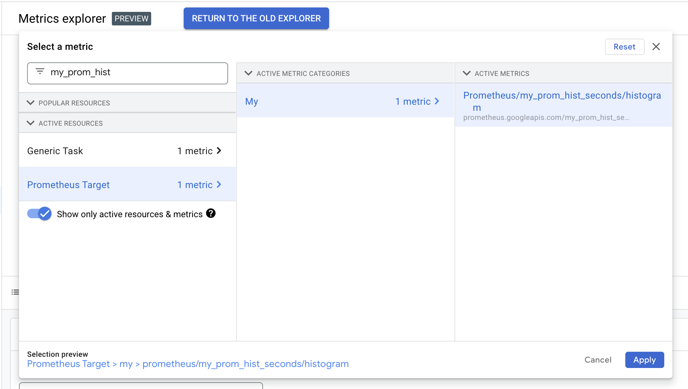
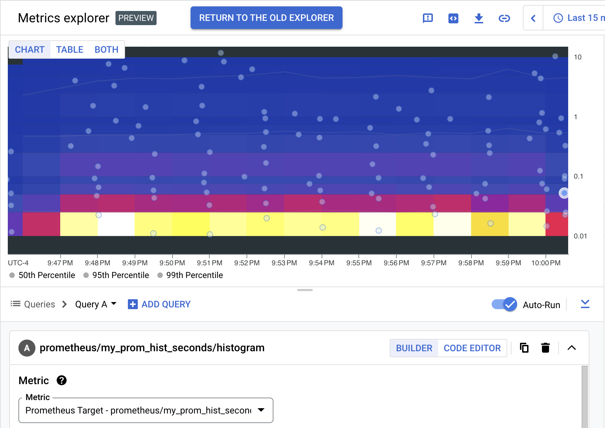
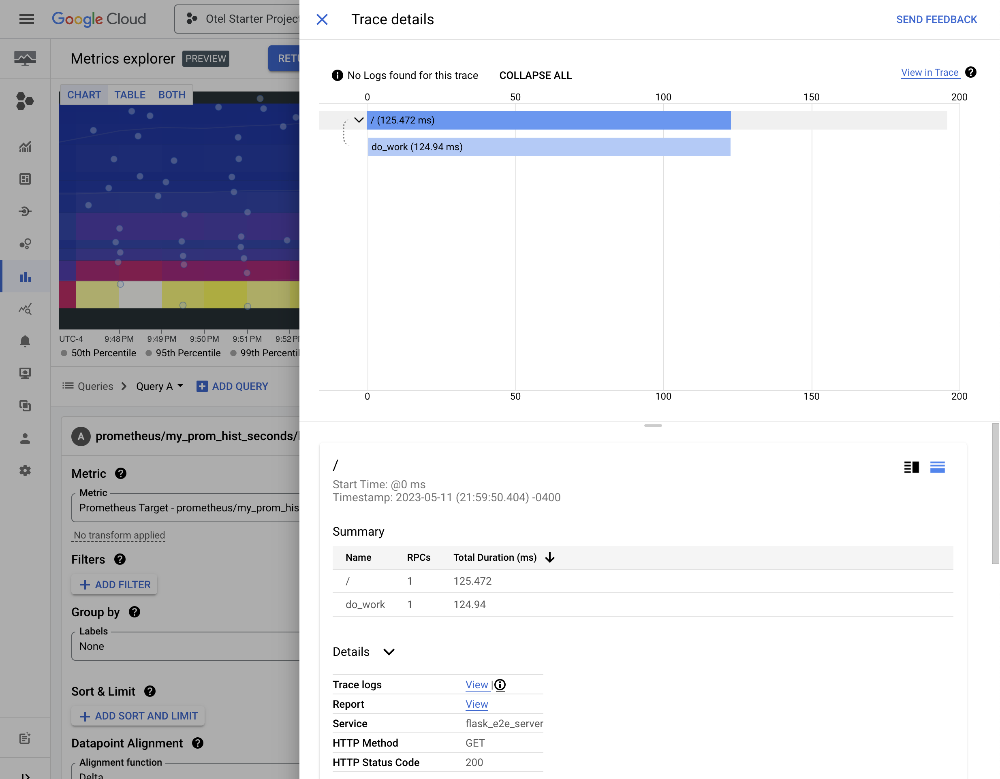

======================================================
Prometheus Metric Exemplars with OpenTelemetry Tracing
======================================================

The full code for this example is available `on Github
<https://github.com/GoogleCloudPlatform/opentelemetry-operations-python/tree/main/docs/examples/prometheus_exemplars>`_.

This end-to-end example shows how to instrument a Flask app with with `Prometheus
<https://prometheus.io/>`_ metrics linked to OpenTelemetry traces using exemplars. The example
manually adds exemplars to a Prometheus Histogram which link the metric in Google Cloud managed
service for Prometheus to Spans in Cloud Trace.

OpenTelemetry Python is configured to send traces to the `OpenTelemetry Collector
<https://opentelemetry.io/docs/collector/>`_ and the Collector scrapes the python server's
Prometheus endpoint. The Collector is configured to send metrics to `Google Cloud Managed
Service for Prometheus <https://cloud.google.com/stackdriver/docs/managed-prometheus>`_ and
traces to `Google Cloud Trace <https://cloud.google.com/trace/docs/overview>`_.

.. graphviz::

    digraph {
        rankdir="LR"
        nodesep=1

        subgraph cluster {
            server [label="Flask Application"]
            col [label="OpenTelemetry Collector"]
        }

        gmp [label="Google Cloud Managed Service for Prometheus" shape="box"]
        gct [label="Google Cloud Trace" shape="box"]

        server->col [label="OTLP traces"]
        col->server [label="Scrape Prometheus"]
        col->gmp [label="metrics"]
        col->gct [label="traces"]
    }

To run this example you first need to:
    * Create a Google Cloud project. You can `create one here <https://console.cloud.google.com/projectcreate>`_.
    * Enable Cloud Trace API (listed in the Cloud Console as Stackdriver Trace API) in the project `here <https://console.cloud.google.com/apis/library?q=cloud%20trace&filter=visibility:public>`_. If the page says "API Enabled" then you're done! No need to do anything.
    * Enable Default Application Credentials by creating setting `GOOGLE_APPLICATION_CREDENTIALS <https://cloud.google.com/docs/authentication/getting-started>`_ or by `installing gcloud sdk <https://cloud.google.com/sdk/install>`_ and calling ``gcloud auth application-default login``.
    * Have docker and docker compose installed on your machine

Attaching Prometheus Exemplars
------------------------------

Prometheus exemplars can be linked to OpenTelemetry spans by setting the ``span_id`` and
``trace_id`` attributes (`specification
<https://github.com/open-telemetry/opentelemetry-specification/blob/v1.20.0/specification/compatibility/prometheus_and_openmetrics.md#exemplars>`_).
You can get the current span using :func:`opentelemetry.trace.get_current_span`, then format
its span and trace IDs to hexadecimal strings using :func:`opentelemetry.trace.format_span_id`
and :func:`opentelemetry.trace.format_trace_id`.

.. literalinclude:: server.py
    :language: python
    :dedent:
    :start-after: [START opentelemetry_prom_exemplars_attach]
    :end-before: [END opentelemetry_prom_exemplars_attach]

Then make an observation using a `Prometheus Histogram
<https://prometheus.io/docs/concepts/metric_types/#histogram>`_ as shown below. Google Cloud
Monitoring can only display exemplars attached to Histograms.

.. literalinclude:: server.py
    :language: python
    :dedent:
    :start-after: [START opentelemetry_prom_exemplars_observe]
    :end-before: [END opentelemetry_prom_exemplars_observe]

Run
---

Checkout the example code if you don't already have the repository cloned:

.. code-block:: sh

  git clone https://github.com/GoogleCloudPlatform/opentelemetry-operations-python.git
  cd docs/examples/prometheus_exemplars

First, set the environment variables needed to provide authentication to the Collector when it
runs in docker.

.. code-block:: sh

    export USERID=$(id -u)
    export PROJECT_ID=<your-gcp-project>
    export GOOGLE_APPLICATION_CREDENTIALS="${HOME}/.config/gcloud/application_default_credentials.json"

Build and start the example containers using ``docker-compose``:

.. code-block:: sh

    docker-compose up --build --abort-on-container-exit

This starts three containers:

#. The Flask server written in ``server.py``. It receives requests and simulates some work by
   waiting for a random amount of time.
#. The OpenTelemetry Collector which receives traces from the Flask server by OTLP and scrapes
   Prometheus metrics from the Flask server's ``/metrics`` endpoint.
#. A load generator that sends constant requests to the Flask server.

Checking Output
---------------

While running the example, you can go to `Cloud Monitoring Metrics Explorer page
<https://console.cloud.google.com/monitoring/metrics-explorer>`_ to see the results. Click on
the "Metric" dropdown, type ``my_prom_hist``, and select the metric from under "Prometheus
Target". The full metric name is ``prometheus.googleapis.com/my_prom_hist_seconds/histogram``.

After selecting the metric, you should see something like the image below, with a heatmap
showing the distribution of request durations in the Python server.

The circles on the heatmap are called "exemplars", which each link to an example span that fell
within the given bucket on the heatmap. Notice that exemplars are plotted at the time when they
occurred (x axis) and duration they took (y axis) in the heatmap. Clicking on an exemplar opens
the Trace details flyout focused on the linked span.

